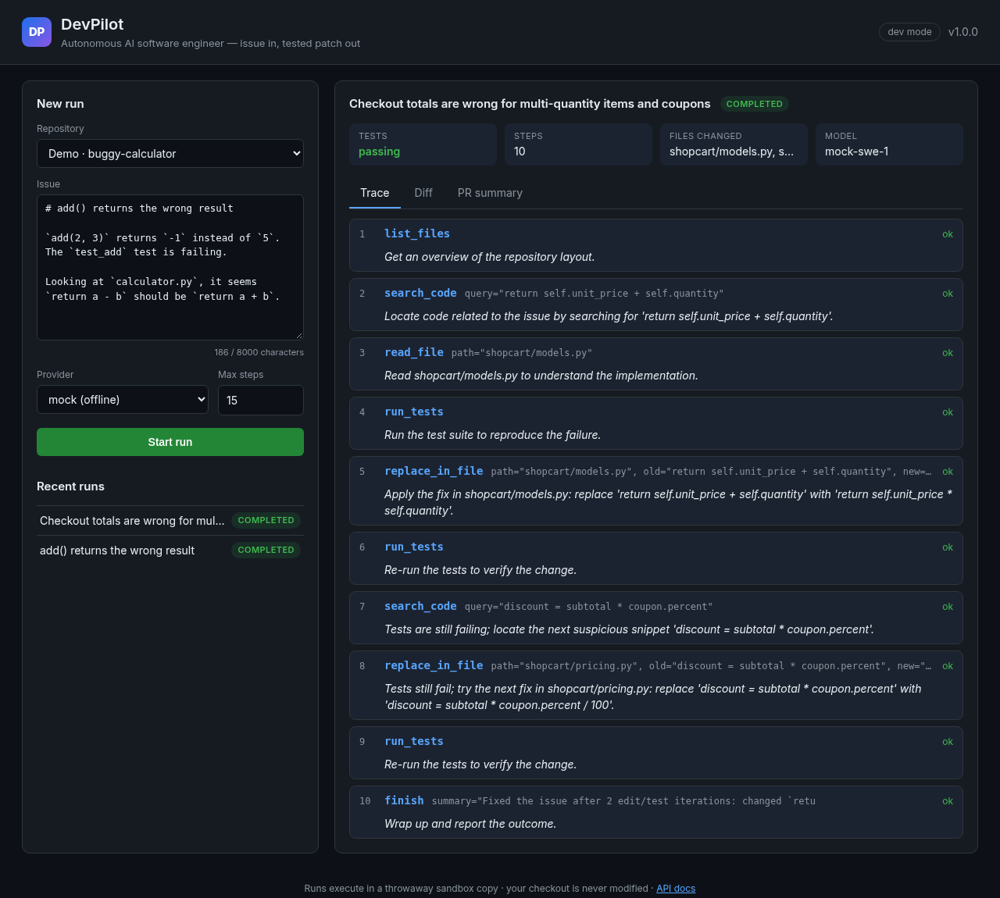
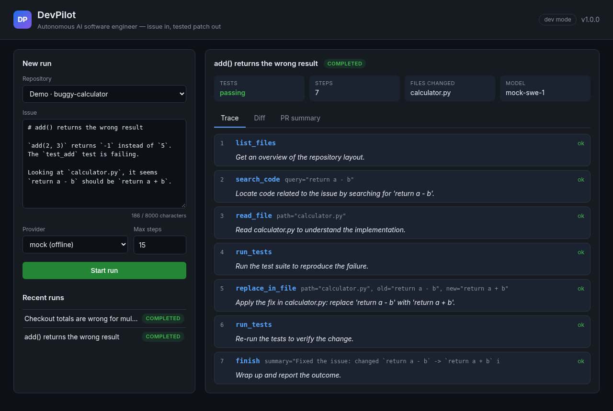
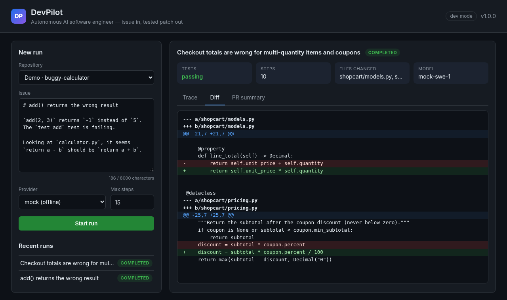
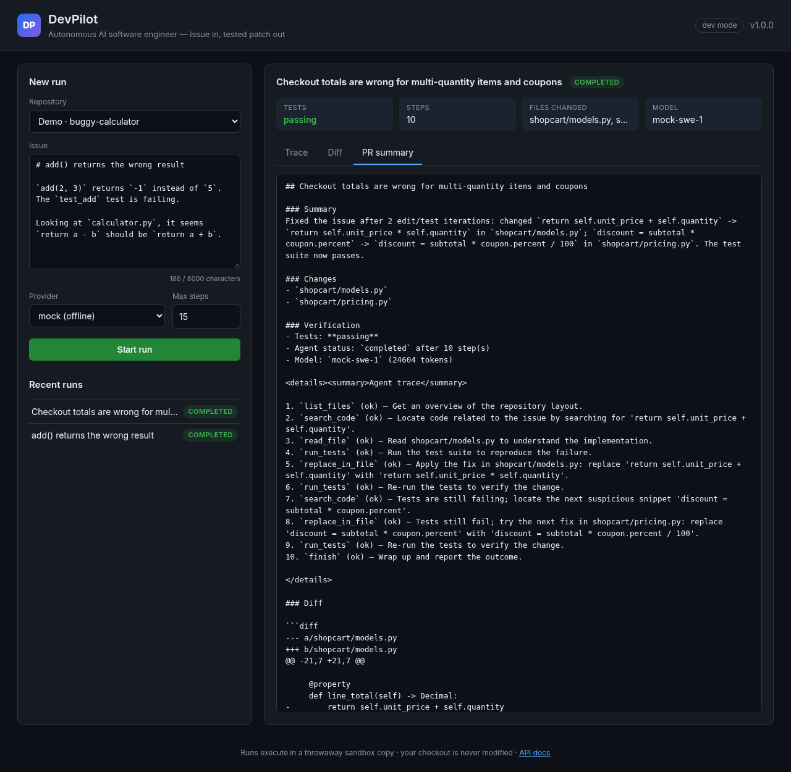
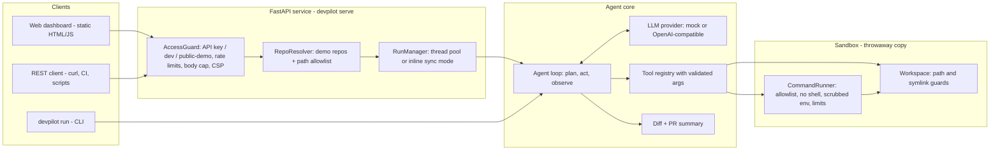
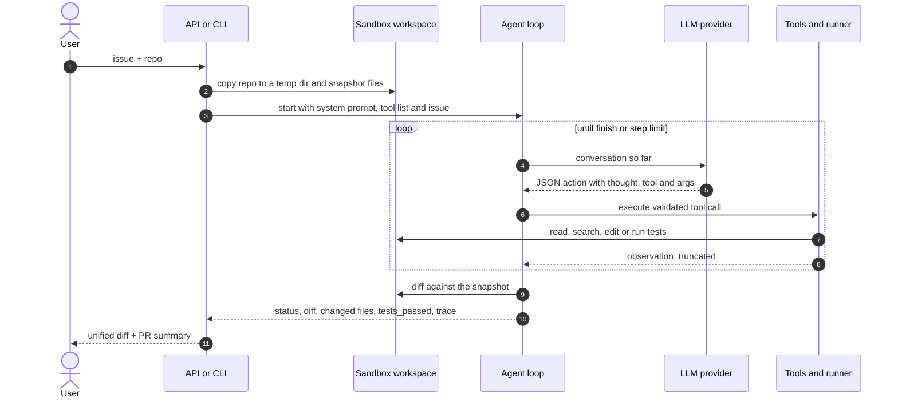

# DevPilot — Autonomous AI Software Engineering Agent

[](https://github.com/bharatkumar00797/devpilot-ai-swe-agent/actions/workflows/ci.yml)
[](https://www.python.org/)
[](LICENSE)
[](pyproject.toml)
[](https://github.com/astral-sh/ruff)

> **An AI agent project.** Give DevPilot an issue and a repository. An LLM-driven agent plans,
> explores the code, writes a patch, runs the tests in a sandbox, iterates on failures and hands
> back a reviewable unified diff with a pull-request summary.

It runs **fully offline by default** with a deterministic mock LLM provider, so the CLI, the API,
the dashboard, the tests and every deployment work with zero API keys. Point it at any
OpenAI-compatible endpoint (OpenAI, Groq, OpenRouter, a local Ollama or vLLM server) to use a
real model.



## Contents

- [The problem](#the-problem) · [Features](#features) · [Screenshots](#screenshots)
- [Architecture](#architecture) · [How a run works](#how-a-run-works)
- [LLM providers](#llm-providers) · [Quick start](#quick-start) · [REST API](#rest-api)
- [Security model](#security-model) · [Deployment](#deployment) · [Configuration](#configuration)
- [Project layout](#project-layout) · [Testing](#testing) · [Roadmap](#roadmap)

## The problem

Most AI coding tools stop at suggesting snippets: a human still has to find the right file, paste
the change, run the tests and find out the suggestion was wrong. That is the expensive part of
fixing a bug.

DevPilot handles a change the way an engineer does: read the issue, explore the repository, reproduce
the failure with the test suite, make a minimal edit, re-run the tests, and only report success
when they pass. The result is not a chat answer but an artifact a reviewer can trust: a diff, the
list of changed files, the test outcome and the full step-by-step trace of what the agent did.

Because an autonomous agent executes code, safety is part of the design rather than an add-on:
every run happens in a throwaway copy of the repository with guarded file access, an allowlist
of commands, no shell, a scrubbed environment and resource limits. Your real checkout, your
secrets and your network are never handed to the agent.

## Features

- **Plan → act → observe agent loop** driven by any LLM through a small JSON action protocol
  that works even with small local models (no native function calling required).
- **Pluggable LLM providers:** offline deterministic `mock` (default) and any OpenAI-compatible
  API, with retries and exponential backoff on 408/409/429/5xx.
- **Tool layer with validated arguments:** list, read, search, replace (unique match only),
  write, run tests, run an allowlisted command. Tool errors become observations so the model
  can self-correct instead of crashing the run.
- **Sandbox guardrails:** copy-on-run workspace, path and symlink escape protection, protected
  files, command allowlist without a shell, timeouts, scrubbed environment, CPU and file-size
  limits, best-effort network isolation.
- **Iterate on failure:** after each edit the tests are re-run; if they are still red the agent
  keeps going (the shopping-cart demo needs two fixes in two modules).
- **Reviewable output:** unified diff, changed files, `tests_passed`, token usage, step trace and
  a Markdown PR summary (`patch.diff`, `PR_SUMMARY.md`, `run.json` from the CLI).
- **Three interfaces:** `devpilot run` CLI, a FastAPI REST API with background runs, and a
  build-free web dashboard with a live trace, colored diff and run history.
- **Production-minded API:** API-key auth (constant-time), dev mode and a safe public-demo mode,
  per-key/IP rate limits, bounded run queue, per-key run ownership, 64 KB body cap, strict CSP.
- **Deploy anywhere:** multi-stage non-root Docker image, hardened docker compose, Render,
  Fly.io, Railway and Vercel (serverless sync mode). CI builds the image and smoke-tests it.

## Screenshots

| Single-file fix (buggy-calculator) | Two bugs, two iterations (shopping-cart) |
| --- | --- |
|  |  |

<details>
<summary>Generated PR summary</summary>



</details>

## Architecture



| Layer | Module | Responsibility |
| --- | --- | --- |
| Interfaces | `cli.py`, `api/` | CLI, REST API, dashboard, auth, rate limiting, run lifecycle |
| Orchestration | `service.py` | builds workspace, runner, tools and provider for one run |
| Agent | `agent/` | loop, prompts, tolerant JSON action parser, result models |
| LLM | `llm/` | provider interface, mock policy, OpenAI-compatible HTTP client |
| Tools | `tools/` | registry with argument validation, built-in workspace tools |
| Sandbox | `sandbox/` | isolated workspace copy, path guard, guarded command runner |
| Output | `report.py` | Markdown PR summary from the run result |

## How a run works



1. **Isolate.** The repository is copied into a temporary directory (skipping `.git`, `.env`,
   `node_modules`, virtualenvs and caches) and every text file is snapshotted. The original
   checkout is never modified.
2. **Prepare tools.** A command runner is bound to that workspace, the tool registry is built,
   and the test command is auto-detected (`pytest`, `npm test`, `go test`, `cargo test`).
3. **Loop.** The model receives a system prompt with the tool catalogue and the issue. Each
   reply must be a JSON action `{"thought", "tool", "args"}`. The parser tolerates code fences
   and prose; invalid replies get a corrective message, and three in a row fail the run.
4. **Act and observe.** The tool runs with validated arguments; its output (truncated head and
   tail) goes back to the model as the next observation. Errors are observations too.
5. **Verify.** Typical flow: list → search → read → run tests (red) → minimal edit → run tests.
   If tests are still red the agent continues with the next fix.
6. **Report.** On `finish` (or the step limit) DevPilot computes a unified diff against the
   snapshot and returns status, summary, changed files, `tests_passed`, token usage and the
   trace, plus a Markdown PR description. Apply the patch with `git apply` after review.

## LLM providers

| Provider | When to use | Configuration |
| --- | --- | --- |
| `mock` (default) | demos, CI, offline development | nothing to set |
| `openai` | any OpenAI-compatible `/chat/completions` API | `DEVPILOT_BASE_URL`, `DEVPILOT_API_KEY`, `DEVPILOT_MODEL` |

The **mock provider** is a real, deterministic policy rather than canned text: it lists files,
searches for the code the issue points at, reads it, runs the tests, applies the concrete
"`X` should be `Y`" suggestions found in the issue one at a time, re-tests after each, and
finishes. It is stateless (everything is derived from the transcript), which makes runs
reproducible. Its honest limit: offline it cannot invent open-ended fixes, and it says so in the
summary.

Real providers (set in `.env` or the environment; keys are never returned by the API):

```bash
# OpenAI
DEVPILOT_PROVIDER=openai DEVPILOT_API_KEY=sk-... DEVPILOT_MODEL=gpt-4o-mini

# Groq
DEVPILOT_PROVIDER=openai DEVPILOT_BASE_URL=https://api.groq.com/openai/v1 \
DEVPILOT_API_KEY=gsk_... DEVPILOT_MODEL=llama-3.3-70b-versatile

# Ollama (local, no key needed)
DEVPILOT_PROVIDER=openai DEVPILOT_BASE_URL=http://localhost:11434/v1 DEVPILOT_MODEL=qwen2.5-coder:7b
```

The CLI takes `--provider mock|openai`; API callers may send `"provider": "openai"` (not allowed
in public-demo mode). The provider credentials always come from the server environment.

## Quick start

```bash
git clone https://github.com/bharatkumar00797/devpilot-ai-swe-agent.git
cd devpilot-ai-swe-agent
python -m venv .venv && source .venv/bin/activate
pip install -e ".[dev]"

# Fully offline run on the bundled demo
devpilot run --repo examples/buggy-calculator \
  --issue-file examples/issues/buggy-calculator.md --out runs/demo
cat runs/demo/PR_SUMMARY.md        # PR description + diff (also patch.diff, run.json)

# Two bugs in two modules: watch the agent iterate on failing tests
devpilot run --repo examples/shopping-cart \
  --issue-file examples/issues/shopping-cart.md --out runs/cart

# REST API + dashboard on http://127.0.0.1:8000 (no auth, localhost only)
devpilot serve --dev
```

| Demo | What it shows |
| --- | --- |
| `examples/buggy-calculator` | single-file bug, one edit, tests red → green in 7 steps |
| `examples/shopping-cart` | two bugs in two modules; fix one, tests still red, fix the second, green in 10 steps |

The dashboard supports deep links: `/#run=<id>` opens a run and `&tab=diff` or `&tab=summary`
selects a tab.

## REST API

Interactive OpenAPI docs are served at `/docs`.

| Method | Path | Auth | Purpose |
| --- | --- | --- | --- |
| `POST` | `/api/runs` | yes¹ | start a run → `202` + run id (sync mode: `200` + finished run and full trace) |
| `GET` | `/api/runs` | yes¹ | your recent runs |
| `GET` | `/api/runs/{id}` | yes¹ | status, summary, diff, changed files, `tests_passed`, PR summary |
| `GET` | `/api/runs/{id}/trace?since=N` | yes¹ | new steps since `N`, `next_cursor`, `done` (polling) |
| `GET` | `/api/config` | no | UI config: version, access mode, demos, providers, limits |
| `GET` | `/healthz` | no | liveness probe: status, version, active runs |
| `GET` | `/` | no | web dashboard |

¹ Depends on the access mode:

| Access mode | Enabled when | Who can call `/api` | Repos | Providers |
| --- | --- | --- | --- | --- |
| `api-key` | `DEVPILOT_API_KEYS` is set | `X-API-Key: <key>` or `Authorization: Bearer <key>` | demos + `DEVPILOT_REPO_ALLOWLIST` | mock, openai |
| `dev` | `serve --dev` or `DEVPILOT_DEV_MODE=true`, no keys | anyone (bind to localhost) | demos + allowlist | mock, openai |
| `public-demo` | neither | anyone, rate limited | bundled demos only | mock only |

```bash
curl -s -X POST localhost:8000/api/runs -H "X-API-Key: change-me" \
  -H "Content-Type: application/json" \
  -d '{"repo": "demo:buggy-calculator", "issue": "`return a - b` should be `return a + b`"}'
```

Request body (`extra` fields are rejected): `repo` (`demo:<name>` or an absolute path inside the
allowlist), `issue` (1–8000 chars), optional `max_steps` (1–100, capped by
`DEVPILOT_MAX_STEPS_CAP`), optional `provider`. Errors: `401` bad key, `403` not allowed in this
mode, `404` unknown run, `413` body over 64 KB, `422` validation, `429` rate limited, `503` queue
full.

The trace uses cursor polling instead of Server-Sent Events because browsers' `EventSource`
cannot send the `X-API-Key` header.

## Security model

An agent that edits code and runs tests is executing untrusted code by design, so DevPilot
layers several guards. None of them is a silver bullet; together they keep a misbehaving model,
or a malicious repository, contained.

**Workspace (filesystem)**

- Copy-on-run: every run works on a temporary copy; your checkout is never written to.
- Path guard: absolute paths, `..`, NUL bytes and anything that resolves outside the workspace
  root (including via symlinks) are rejected; symlinked files are not listed.
- Protected files: `.git/*`, `.env`, `.env.*`, `*.pem`, `*.key`, `id_rsa*` cannot be written;
  `.env` files cannot be read; per-file size cap.
- `replace_in_file` requires the old text to match exactly once, forcing small precise edits.

**Command execution**

- Commands are parsed with `shlex` and executed **without a shell**; shell metacharacters
  (`; | & $ < >` backticks, newlines) are rejected.
- Prefix allowlist: `pytest`, `python -m pytest|unittest`, `npm test`, `npm run test|lint`,
  `go test|vet`, `cargo test`, `ruff check`. Notably not `python -c` or arbitrary binaries.
  Arguments may not be absolute paths or contain `..`.
- Scrubbed environment: only `PATH`, `LANG`, `LC_ALL`, `TZ` pass through and `HOME` is the
  workspace, so provider keys and cloud credentials never reach the child process.
- Limits: wall-clock timeout with a process-group `SIGKILL`, `RLIMIT_CPU`, 64 MB
  `RLIMIT_FSIZE`, and output truncation so a noisy suite cannot flood the model context.
- Network isolation (best effort): on Linux, commands run under `unshare -rn` (a user + network
  namespace with no interfaces) when the host allows it; this is probed once and skipped where
  unprivileged namespaces are blocked (for example Docker's default seccomp profile).

**Container hardening (the real boundary)**

The Docker image runs as non-root uid 10001 with a two-stage build and no compilers. The compose
file adds a read-only root filesystem, a `nosuid,nodev` tmpfs for `/tmp`, `cap_drop: ALL`,
`no-new-privileges`, and pids/memory/CPU limits. For untrusted repositories, run DevPilot inside
a container like this (optionally with an egress-blocking network policy); treat the in-process
guards as defence in depth.

**HTTP API**

- API keys are stored as SHA-256 digests and compared with `hmac.compare_digest` against every
  configured key (constant time); runs are visible only to the key that created them.
- Sliding-window rate limits per key or IP on every `/api` call, plus a stricter limit on run
  creation (counted only after validation passes); bounded identity table.
- Bounded run queue (`503` when full), step cap, issue length cap, 64 KB request body cap.
- Strict pydantic validation (`extra=forbid`, control characters rejected).
- Repository allowlist: paths are `resolve()`d (following symlinks) and must stay inside an
  allowlisted directory; public-demo mode accepts bundled demos only.
- Security headers: strict CSP (`default-src 'self'`, no inline scripts, `frame-ancestors
  'none'`), `X-Frame-Options: DENY`, `nosniff`, `no-referrer`. CORS is off unless
  `DEVPILOT_CORS_ORIGINS` is set. The dashboard renders all server data with `textContent`.
- Client IP: `X-Forwarded-For` is used only when `DEVPILOT_TRUST_PROXY=true`, and then the
  **right-most** hop (the one your proxy appended) is taken; the left-most value is
  client-controlled and would let callers dodge rate limits.
- Secrets only come from the environment; provider keys never appear in any response.

**Residual risks (honest list)**

- Test suites execute repository code. Inside the allowlist a malicious `conftest.py` can still
  run arbitrary Python as the service user; containment then relies on the container.
- Where `unshare` is unavailable, sandboxed commands have the host's network access.
- `RLIMIT_CPU` and the timeout bound a single command, not total memory; use container limits.
- Rate limits, run history and ownership are in memory: per process, reset on restart and only
  best-effort across serverless instances.
- The mock provider is safe by construction; a real LLM may produce wrong patches. The output is
  a diff for human review, never an automatic merge.

See [SECURITY.md](SECURITY.md) for how to report a vulnerability.

## Deployment

Every target runs the same app. Without `DEVPILOT_API_KEYS` it starts as a **public demo**
(bundled repos + offline mock provider, no paid keys needed). `GET /healthz` is the health check
everywhere, and `scripts/smoke_test.py <url>` (stdlib only) verifies any running instance by
running every demo through the API.

### Long-running container vs serverless

| | Docker, Render, Fly.io, Railway | Vercel |
| --- | --- | --- |
| Process | one long-running server | short-lived function instances |
| Runs | background thread pool; `POST` returns `202`, the dashboard polls the trace | inline (sync mode); `POST` returns `200` with the finished run and full trace |
| State | in memory for the life of the process | in memory **per instance**; history and rate limits are best-effort |
| Limits | `DEVPILOT_MAX_CONCURRENT_RUNS`, queue size | `maxDuration: 60` s, step cap 20, command timeout 30 s |

Sync mode exists because serverless platforms freeze background threads once the response is
sent, and a follow-up `GET` may land on a different instance. It turns on automatically when
`VERCEL` or `AWS_LAMBDA_FUNCTION_NAME` is set, or explicitly with `DEVPILOT_SYNC_RUNS=true`.

### Docker and docker compose

```bash
docker build -t devpilot-ai .
docker run --rm -p 8000:8000 devpilot-ai            # public demo on http://localhost:8000

cp .env.example .env                                  # optional: keys, provider, limits
docker compose up --build                             # hardened: read-only, caps dropped
python scripts/smoke_test.py http://127.0.0.1:8000
```

The image honours `$PORT`, bakes the demos into `/app/examples` and has an exec-form
`HEALTHCHECK`. CI runs `docker compose up --build --wait` and the smoke test on every push.

### Render

1. **New → Blueprint**, select this repository; `render.yaml` defines a Docker web service with
   `healthCheckPath: /healthz`, `DEVPILOT_TRUST_PROXY=true` and one concurrent run (free plan).
2. Optional: add `DEVPILOT_API_KEYS` (and provider settings) as secret environment variables.

### Fly.io

```bash
fly launch --copy-config --no-deploy   # uses fly.toml (port 8080, HTTPS, /healthz check)
fly secrets set DEVPILOT_API_KEYS=change-me   # optional
fly deploy
```

Machines auto-stop when idle and start on the next request.

### Railway

Create a project from the GitHub repo. `railway.json` selects the Dockerfile builder, the
`/healthz` health check and restart-on-failure; Railway injects `PORT`. Set
`DEVPILOT_TRUST_PROXY=true` and any secrets under **Variables**.

### Vercel

Import the repository (framework preset: FastAPI / Other); no build settings are needed.
`api/index.py` exposes the ASGI `app`, puts `src/` on the path and defaults to sync mode, a
20-step cap and a 30 s command timeout. `vercel.json` bundles `examples/**` and the static
dashboard into the function and sets `maxDuration: 60`. Keep the public-demo default or add
`DEVPILOT_API_KEYS` in the project settings. Limits: each run must finish within the function
duration, runs and rate-limit counters are per instance, and the network isolation probe is
typically unavailable (the platform sandbox is the boundary).

## Configuration

All settings are environment variables (see [`.env.example`](.env.example)).

| Variable | Default | Description |
| --- | --- | --- |
| `DEVPILOT_PROVIDER` | `mock` | `mock` (offline) or `openai` (any OpenAI-compatible API) |
| `DEVPILOT_BASE_URL` | `https://api.openai.com/v1` | API base URL (Groq, Ollama, OpenRouter, vLLM, ...) |
| `DEVPILOT_API_KEY` | _(empty)_ | provider key; sent as a Bearer token, never returned |
| `DEVPILOT_MODEL` | `gpt-4o-mini` | model name for the `openai` provider |
| `DEVPILOT_MAX_STEPS` | `15` | default agent step budget |
| `DEVPILOT_COMMAND_TIMEOUT` | `60` | seconds per sandboxed command |
| `DEVPILOT_ISOLATE_NETWORK` | `true` | use `unshare -rn` for commands when available |
| `DEVPILOT_API_KEYS` | _(empty)_ | comma-separated API keys; enables `api-key` mode |
| `DEVPILOT_DEV_MODE` | `false` | no auth (localhost only); same as `serve --dev` |
| `DEVPILOT_REPO_ALLOWLIST` | _(empty)_ | comma-separated directories whose sub-folders may be used as `repo` |
| `DEVPILOT_CORS_ORIGINS` | _(empty)_ | comma-separated browser origins; empty = same-origin only |
| `DEVPILOT_RATE_LIMIT_PER_MINUTE` | `60` | `/api` requests per key or IP per minute |
| `DEVPILOT_RUN_LIMIT_PER_MINUTE` | `6` | run creations per key or IP per minute |
| `DEVPILOT_MAX_CONCURRENT_RUNS` | `2` | worker threads (minimum 1) |
| `DEVPILOT_MAX_QUEUED_RUNS` | `8` | queued + running runs before `503` |
| `DEVPILOT_MAX_STEPS_CAP` | `30` | upper bound for a request's `max_steps` |
| `DEVPILOT_MAX_RUNS_KEPT` | `200` | finished runs kept in memory (minimum 10) |
| `DEVPILOT_TRUST_PROXY` | `false` | use the right-most `X-Forwarded-For` hop as client IP |
| `DEVPILOT_SYNC_RUNS` | auto | run inside `POST /api/runs`; auto-on with `VERCEL` / `AWS_LAMBDA_FUNCTION_NAME` |
| `DEVPILOT_DEMO_DIR` | `./examples` | bundled demo repos (+ `issues/<name>.md`) |
| `PORT` | `8000` | container listen port (Render, Railway and Fly inject it) |
| `DEVPILOT_HOST_PORT` | `8000` | host port published by docker compose |

## Project layout

```
.
├── src/devpilot/
│   ├── agent/        plan → act → observe loop, JSON action parser, prompts, result models
│   ├── llm/          provider interface, offline mock policy, OpenAI-compatible client
│   ├── tools/        tool registry (validated args) + built-in workspace tools
│   ├── sandbox/      isolated workspace copy, path guard, allowlisted command runner
│   ├── api/          FastAPI app, run manager, auth + rate limiting, repo allowlist, settings
│   │   └── static/   dashboard (plain HTML/CSS/JS, no build step)
│   ├── report.py     Markdown PR summary
│   ├── service.py    wires workspace, tools and provider for one run
│   └── cli.py        `devpilot run` and `devpilot serve`
├── api/index.py      Vercel serverless entrypoint
├── examples/         demo repos (buggy-calculator, shopping-cart) + issue texts
├── scripts/          smoke_test.py for any running instance
├── tests/            unit, API and end-to-end demo tests
├── docs/screenshots/ dashboard screenshots
├── Dockerfile, docker-compose.yml, render.yaml, fly.toml, railway.json, vercel.json
└── .github/workflows/ci.yml
```

## Testing

```bash
ruff check . && ruff format --check .   # lint + formatting
mypy                                    # strict type checking of src/devpilot
pytest                                  # 69 tests, fully offline (mock provider)
```

The suite covers the action parser, the agent loop (including invalid-reply recovery and step
limits), workspace path and symlink guards, the command runner (allowlist, metacharacters,
timeouts, environment scrubbing), every tool, both demos end to end, and the API (auth modes,
rate limits, ownership, validation, body cap, headers, sync vs async mode, proxy handling).
CI runs it on Python 3.11 and 3.12, then builds the Docker image and smoke-tests it.

## Roadmap

- Git URL mode: clone public repositories (HTTPS only, host allowlist, shallow, size and time caps)
- Native tool-calling for providers that support it, with the JSON protocol as fallback
- Persistent run store (SQLite or Redis) for shared history across instances
- Open the result as a GitHub pull request via a GitHub App
- Stronger per-run isolation (gVisor or Firecracker) for untrusted repositories
- Evaluation harness over a set of real-world issues to compare models

## Contributing

See [CONTRIBUTING.md](CONTRIBUTING.md) and the [changelog](CHANGELOG.md).

## License

[MIT](LICENSE) © Bharatkumar Chandvani
